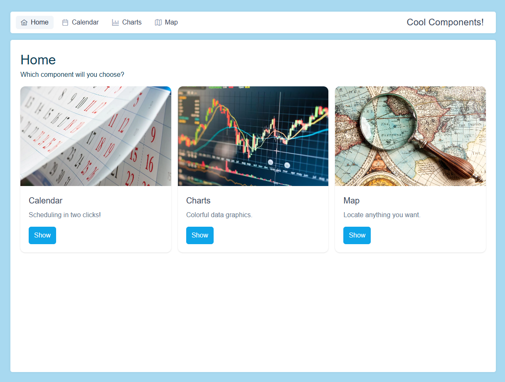
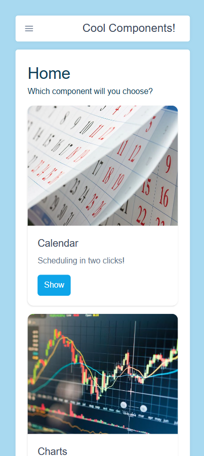
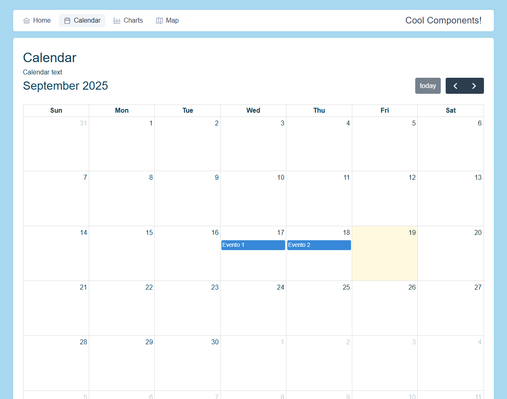
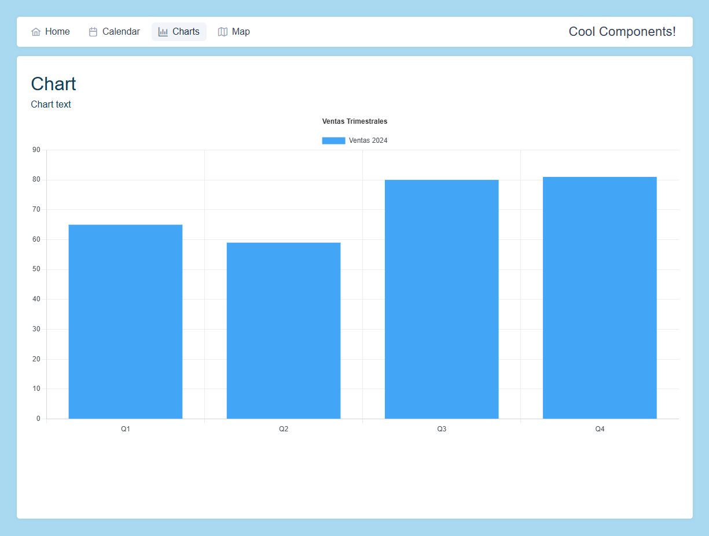
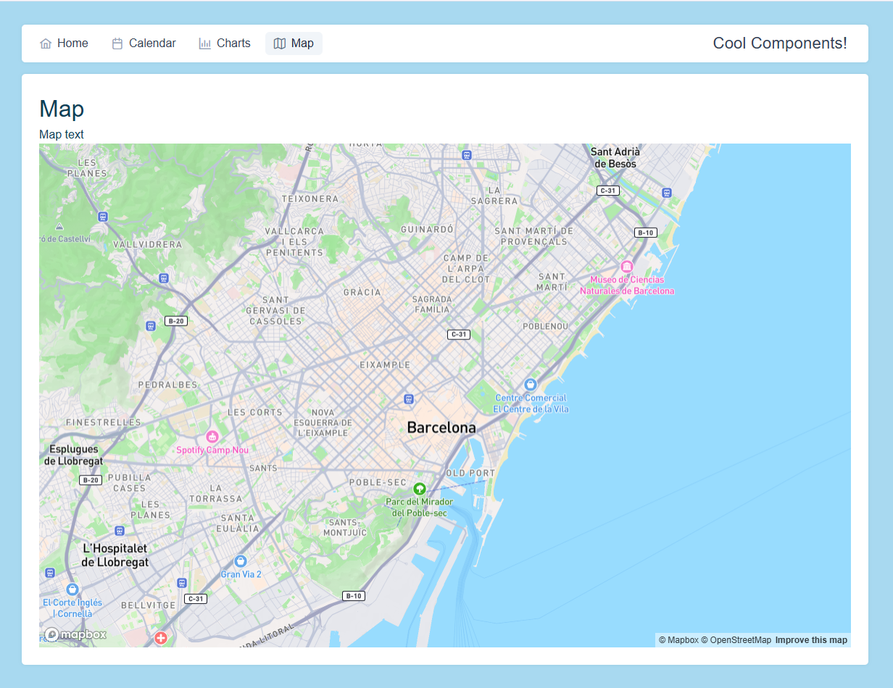
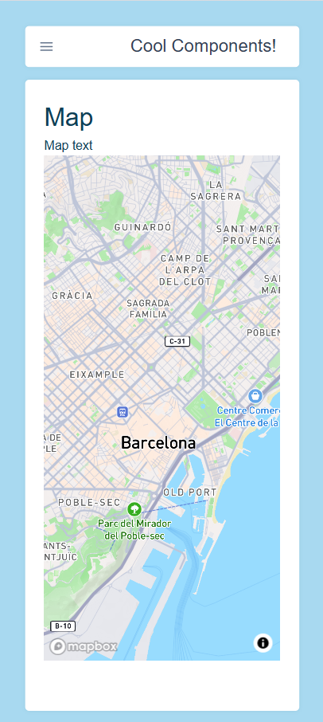

# IT-S8-Calendar-Chart-Map

## 🗂️Tabla de contenidos

- [IT-S8-Calendar-Chart-Map](#it-s8-calendar-chart-map)
  - [🗂️Tabla de contenidos](#️tabla-de-contenidos)
  - [📄Descripción](#descripción)
    - [1. Crear componentes Menú, Home, Calendario, Gráfico y Mapa](#1-crear-componentes-menú-home-calendario-gráfico-y-mapa)
  - [💻Tecnologías Utilizadas](#tecnologías-utilizadas)
  - [📋Requisitos](#requisitos)
  - [🛠️Instalación](#️instalación)
    - [1. Descargar el repositorio](#1-descargar-el-repositorio)
    - [2. Instalación de paquetes Node.js](#2-instalación-de-paquetes-nodejs)
    - [3. Instalación de Angular](#3-instalación-de-angular)
    - [4. Instalación de PrimeNG](#4-instalación-de-primeng)
    - [5. Instalación de Tailwind](#5-instalación-de-tailwind)
    - [6. Instalación de Plugin PrimeNg-Tailwind](#6-instalación-de-plugin-primeng-tailwind)
    - [7. Instalación de MapBox](#7-instalación-de-mapbox)
    - [8. Instalación de Chart.js](#8-instalación-de-chartjs)
    - [9. Instalación de FullCalendar](#9-instalación-de-fullcalendar)
    - [10. Instalación de Nest.js](#10-instalación-de-nestjs)
    - [11. Instalación de Express.js](#11-instalación-de-expressjs)
    - [12. Instalar TypeORM](#12-instalar-typeorm)
    - [5. Instalación de Firebase](#5-instalación-de-firebase)
      - [5.1 Instalar Firebase en el proyecto](#51-instalar-firebase-en-el-proyecto)
  - [▶️Ejecución](#️ejecución)
    - [Frontend](#frontend)
      - [Testing](#testing)
    - [Backend](#backend)
  - [📸 Demo](#-demo)

## 📄Descripción

PENDIENTE

### 1. Crear componentes Menú, Home, Calendario, Gráfico y Mapa

- Instalación y configuración de todos los componentes.
- Creación y formato del menú principal.
- Creación y formato inicial de todas las páginas.
- Configuración de las rutas.
- Añadir tarjetas enrutadas en la página principal.
- Añadir calendario de prueba en la página de calendario.
- Añadir gráfico de prueba en la página de gráficos.
- Añadir mapa de prueba en la página de mapa.

<div style="display: flex; flex-wrap: wrap; gap: 20px; align-items: flex-start; margin-top: 1rem;">
  
  
  
</div>
<div style="display: flex; flex-wrap: wrap; gap: 20px; align-items: flex-start; margin-top: 1rem;">
  
  
  
</div>


## 💻Tecnologías Utilizadas

PENDIENTE

- [x] HTML
- [x] CSS
- [x] Typescript
- [x] Angular
- [x] Eslint
- [x] Karma / Jasmine
- [x] PrimeNG
- [x] Tailwind
- [x] MapBox
- [x] Chart.js
- [x] FullCalendar
- [x] Nest.js
- [x] TypeORM

## 📋Requisitos

PENDIENTE

- Navegador web
- Node.js
- Angular
- Firebase
  
## 🛠️Instalación

PENDIENTE

### 1. Descargar el repositorio

```shell
git clone https://github.com/soyjuandelgado/IT-S8-Inprocode.git destino
```

### 2. Instalación de paquetes Node.js

```shell
npm install
```

### 3. Instalación de Angular

```shell
npm install -g @angular/cli
```

### 4. Instalación de PrimeNG

```bash
npm install primeng @primeuix/themes
npm install primeng primeicons primeflex
```

Si no funciona, actualizar el CLI de Angular:

```bash
npm install -g @angular/cli@latest
ng update @angular/cli @angular/core
```

### 5. Instalación de Tailwind

```bash
npm install tailwindcss @tailwindcss/postcss postcss --force
```

### 6. Instalación de Plugin PrimeNg-Tailwind

```bash
npm i tailwindcss-primeui
```

### 7. Instalación de MapBox

```bash
npm install mapbox-gl
```

### 8. Instalación de Chart.js

```bash
npm install chart.js
```

### 9. Instalación de FullCalendar

```bash
   npm install @fullcalendar/angular @fullcalendar/core @fullcalendar/daygrid @fullcalendar/interaction
```

### 10. Instalación de Nest.js

```bash
npm i -g @nestjs/cli
```

### 11. Instalación de Express.js

```bash
npm install express
```

### 12. Instalar TypeORM

```bash
npm install --save @nestjs/typeorm typeorm mysql
```


### 5. Instalación de Firebase

```shell
npm install -g firebase-tools
```

Hacer login en firebase:

```bash
firebase login
```

#### 5.1 Instalar Firebase en el proyecto

```bash
ng add @angular/fire
```

Si da errores, se puede forzar la instalación

```bash
npm install @angular/fire --legacy-peer-deps
```

Si continúa fallando actualizar el sistema:

```bash
npm install -g @angular/cli@latest
ng update @angular/cli @angular/core
```

## ▶️Ejecución

### Frontend

```shell
ng serve -o
```

#### Testing

```shell
ng test
```

### Backend

```shell
npm run start
```

## 📸 Demo

Visitar la web: [Web](https://it-s8-calendar-chart-map.vercel.app/)
